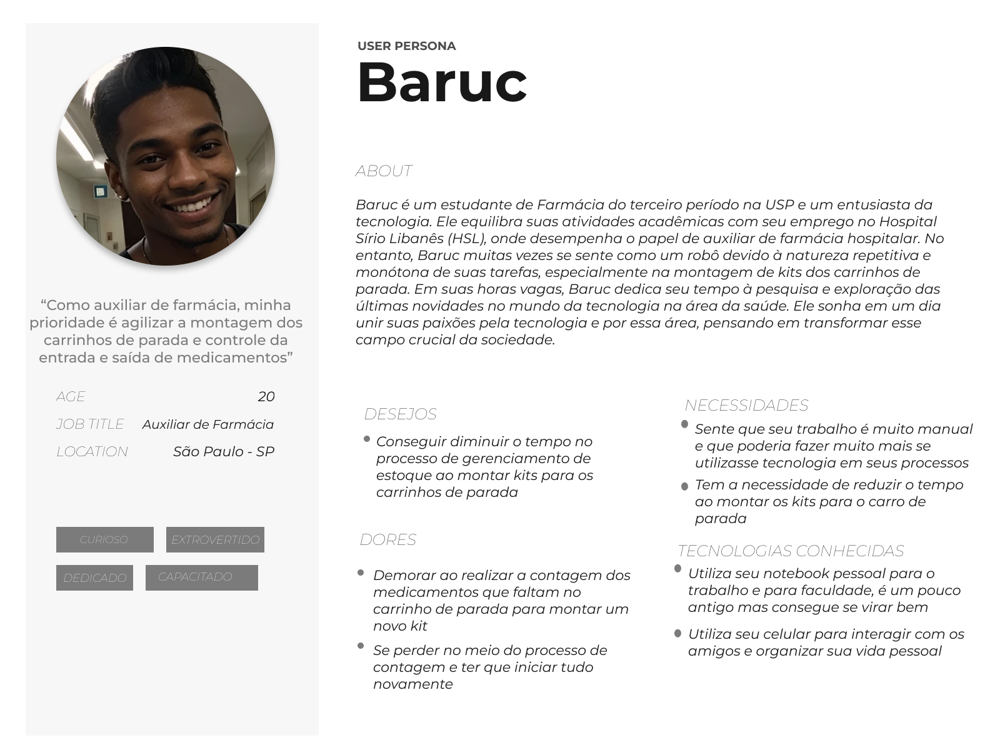
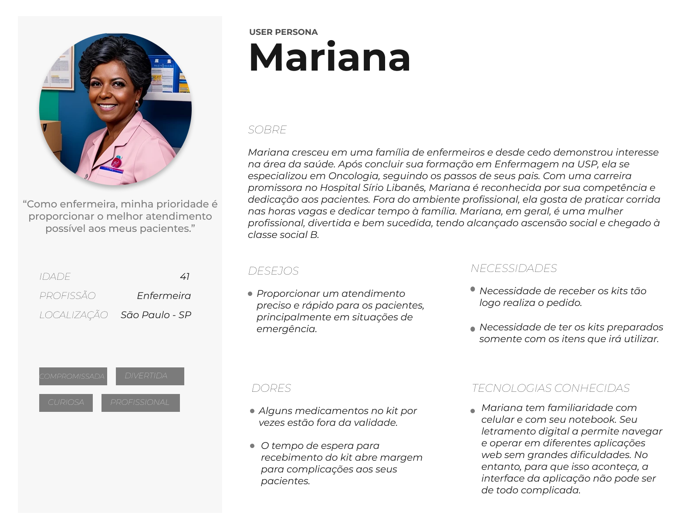
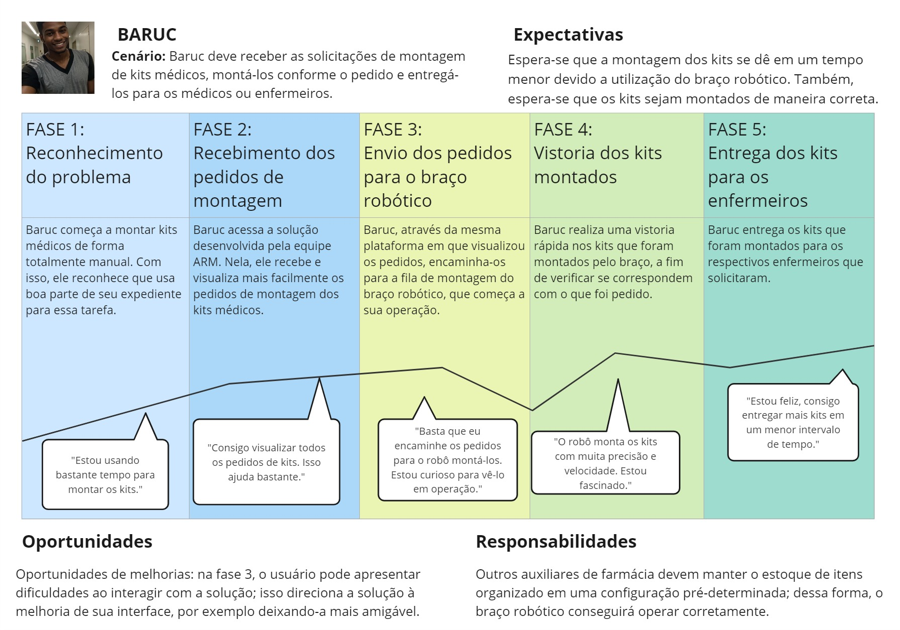

# Personas

&emsp;A persona, um retrato fictício do cliente ideal de um negócio, é elaborada com base em informações e características reais do público-alvo. Essa ferramenta constroi representações fictícias de clientes ideais, baseadas em dados reais e pesquisas com o público-alvo. Elas ajudam a entender melhor as necessidades, dores, objetivos e comportamentos dos usuários finais.

&emsp;Desenvolver personas pode ajudar uma equipe a formular um IoT para o Hospital Sírio-Libanês. Isso porque, ao criar personas, a equipe pode se colocar no lugar dos usuários e criar soluções mais adequadas e personalizadas para eles. Como parte deste projeto, foram desenvolvidas representações visuais ilustrativas de duas personas principais identificadas abaixo:

Figura 2 - Persona Baruc 

Fonte: Elaborado pelos próprios autores 

Figura 2 - Persona Mariana 

Fonte: Elaborado pelos próprios autores 

&emsp;Em resumo, a criação de personas é mais do que uma simples representação gráfica de usuários; é um processo dinâmico e estratégico que amplia a compreensão das necessidades, expectativas e desafios que nossos clientes enfrentam. Ao desenvolver personas significativas, não apenas moldamos produtos e serviços mais alinhados com as demandas reais, mas também cultivamos uma conexão mais profunda e empática com nosso público.

&emsp;Portanto, a construção de personas transcende a esfera do design e se estende a toda a estratégia empresarial, orientando-nos na busca constante pela satisfação do cliente e pela inovação centrada nas pessoas. Dessa maneira, destaca-se o público raiz que vai utilizar a solução: profissionais da saúde e equipes de gestão. Com isso em mente, a equipe pode guiar o desenvolvimento com objetivos claros e palpáveis.

# Jornada do Usuário

&emsp;O Mapa de Jornada do Usuário é uma ferramenta visual que retrata a sequência de interações que um usuário tem com um produto ou serviço. Ele fornece uma narrativa clara e organizada das experiências, sentimentos, pontos de dor e pontos de satisfação de um usuário ao longo de um processo. Esta ferramenta é essencial para identificar oportunidades de melhoria e otimização da experiência do usuário.[1]

&emsp;A jornada do usuário consiste em mais do que um auxílio para compreender como se dá a interação do usuário com a solução: é uma grande aliada para mapear os pontos de atrito desse contato. Isso se torna essencial para o desenvolvimento do projeto, porque cria-se tempo para resolver esses pontos de frustração a tempo. Para o caso da solução planejada para o Hospital Sírio-Libanês(HSL), o parceiro de negócios, foi elaborada uma jornada de usuário com base na persona do Baruc, como é possível ver abaixo:

Figura 3 - Mapa de Jornada do Usuário 

Fonte: Elaborado pelos próprios autores 

&emsp;Esse mapa de jornada do usuário foi elaborado em cinco principais fases, sendo elas: "Reconhecimento do problema", em que o usuário percebe o demasiado tempo gasto na tarefa; "Recebimento dos pedidos de montagem", em que ocorre a primeira interação do usuário com a solução a ser desenvolvida; "Envio dos pedidos para o braço robótico", em que o usuário final vai, de fato, se valer de uma das principais funcionalidades da solução; "Vistoria dos kits montados", em que o usuário confirma a organização dos kits; e "Entrega dos kits para os enfermeiros", fase na qual o usuário final vai distribuir os kits montados pelo braço robótico para os respectivos enfermeiros que os solicitaram.

## Bibliografia
[1] UX RESEARCH - Descrição do Artefato. Disponível em: [https://drive.google.com/file/d/1KHHCBewZ61Y72_BbM_CPS_Gvp16f12VR/view](https://drive.google.com/file/d/1KHHCBewZ61Y72_BbM_CPS_Gvp16f12VR/view). Acesso em: 16 fev. 2024.